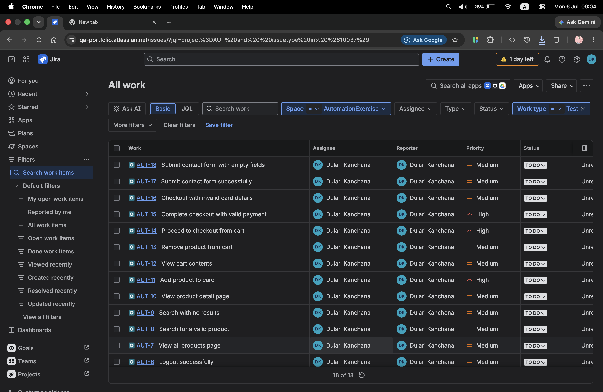
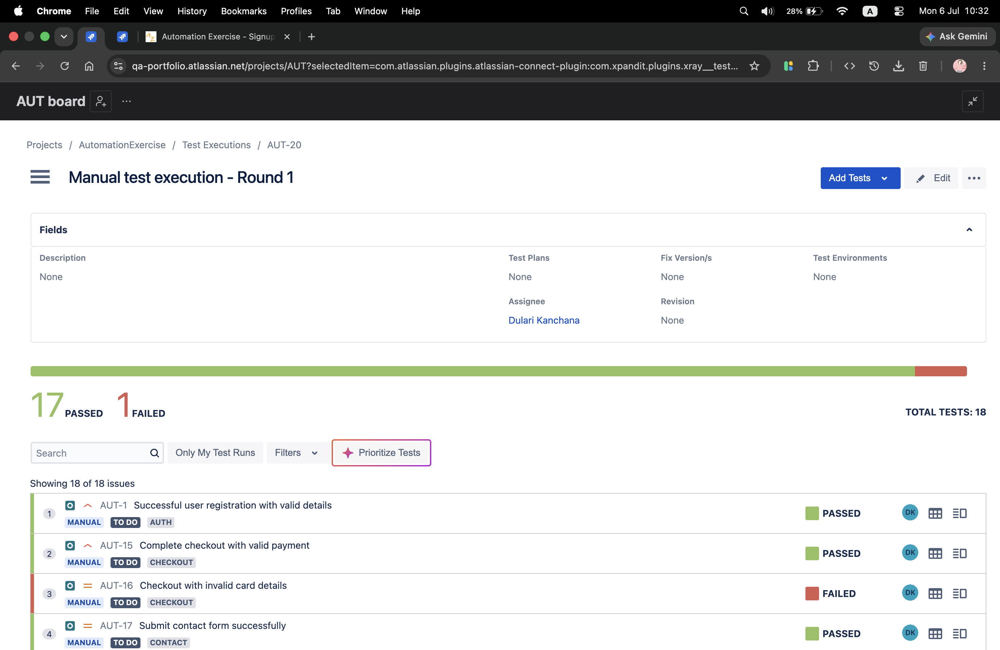
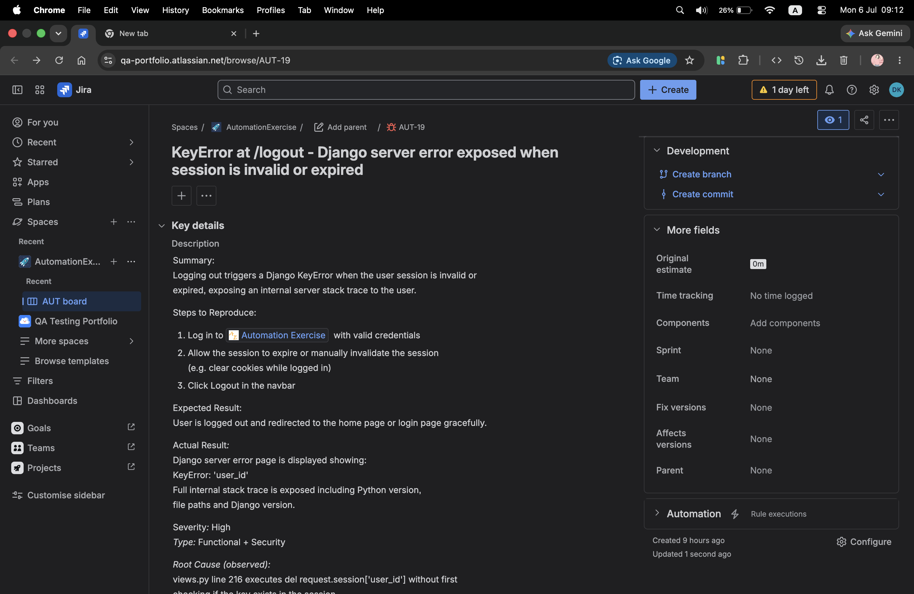
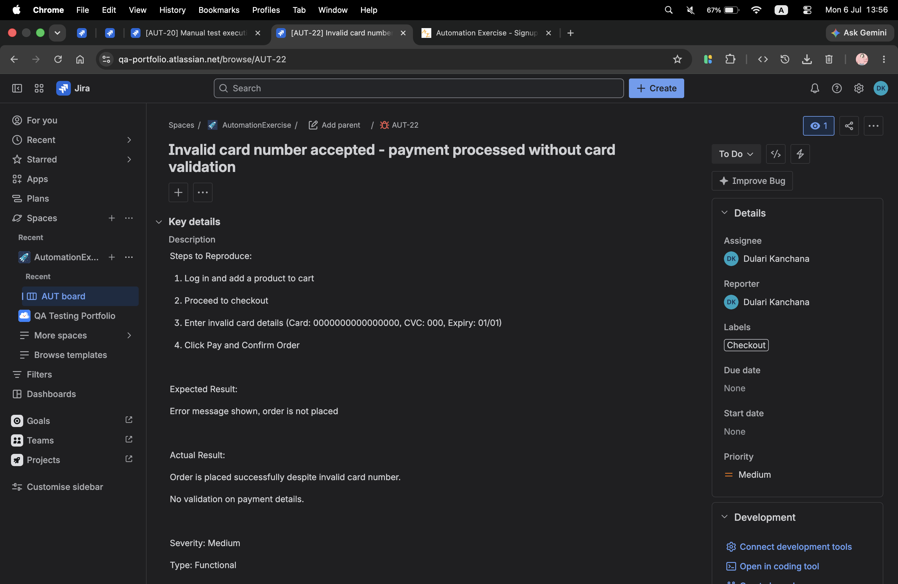
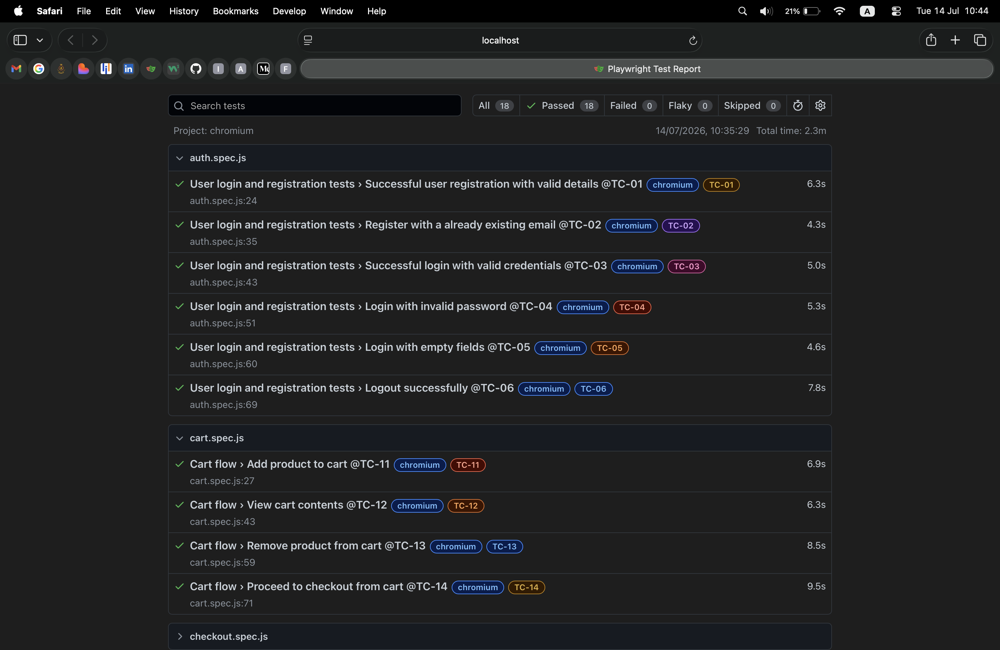
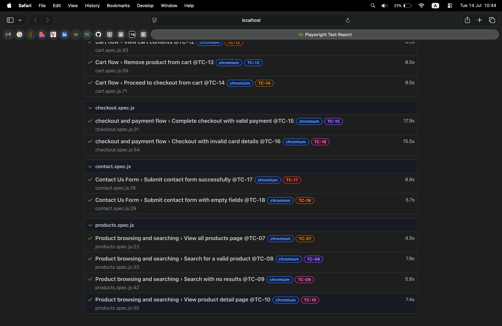

# AutomationExercise - QA Portfolio Project

End-to-end QA project on [AutomationExercise.com](https://automationexercise.com) covering 
the complete testing lifecycle: exploratory testing, test planning, manual test execution, 
bug reporting, and Playwright automation with Page Object Model architecture.

---

## 🛠️ Tools & Stack

| Tool | Purpose |
|---|---|
| Jira + Xray | Test case management and execution tracking |
| Playwright (JavaScript) | E2E test automation |
| GitHub Actions | CI/CD pipeline |
| Chrome | Primary test browser |

---

## Project Structure
```
automationexercise-qa-portfolio/
├── docs/
│   ├── test-plan.md
│   └── bug-reports.md
├── test-cases/
│   └── AE-Test-Cases.csv
├── screenshots/
├── pages/
│   ├── BasePage.js
│   ├── HomePage.js
│   ├── LoginPage.js
│   ├── RegisterPage.js
│   ├── ProductsPage.js
│   ├── ProductDetailPage.js
│   ├── CartPage.js
│   ├── CheckoutPage.js
│   ├── PaymentPage.js
│   └── ContactPage.js
├── tests/
│   ├── auth.spec.js
│   ├── products.spec.js
│   ├── cart.spec.js
│   ├── checkout.spec.js
│   └── contact.spec.js
├── test-data/
│   └── testData.json
├── playwright.config.js
└── README.md
```
---

## Exploratory Testing

Conducted session-based exploratory testing across all major flows before writing 
any formal test cases. Discovered a real bug during this phase - a Django `KeyError` 
server error exposed when logging out with an invalidated session revealing internal stack trace information 
including Python version, file paths and Django version to the end user.

---

## Test Plan

Defined scope, objectives, test types, entry/exit criteria and risks
before any test cases were created.

See [`docs/test-plan.md`](docs/test-plan.md)

---

## Manual Test Cases

18 manual test cases written and managed in **Jira + Xray** across 5 modules:

| Module | Cases | Priority |
|---|---|---|
| Auth | 6 | High / Medium |
| Products | 4 | Medium |
| Cart | 4 | High / Medium |
| Checkout | 2 | High / Medium |
| Contact | 2 | Medium |

See [`test-cases/AE-Test-Cases.csv)`](test-cases/AE-Test-Cases.csv)

---

## Manual Test Execution

All 18 tests executed manually in Xray - **17 Pass / 1 Fail**.

Failed test: AUT-16 (Checkout with invalid card) → raised as bug AUT-22.

---

## Bugs Found

| ID | Summary | Severity | Found During |
|---|---|---|---|
| AUT-19 | KeyError at /logout - Django stack trace exposed | High | Exploratory Testing |
| AUT-22 | Invalid card accepted - no payment validation | Medium | Manual Execution |

See [`docs/bug-report.md`](docs/bug-report.md)

---

## Playwright Automation

Automated all 18 test cases using Playwright with JavaScript following 
Page Object Model architecture.

**Key architectural decisions:**
- `BasePage` class with shared helper methods extended by all page classes
- Centralised test data in `test-data/testData.json`
- Object destructuring for method parameters
- `test.fail()` on AUT-16 to document known bug without blocking suite
- `workers: 1` in config for sequential execution - tests share user account and cart state
- `waitForTimeout` workaround in contact form for Chrome dialog timing issue (documented TODO)

**Run tests:**
```bash
npx playwright test
```

**Run with UI mode:**
```bash
npx playwright test --ui
```

**View HTML report:**
```bash
npx playwright show-report
```

---

## Screenshots

| | |
|---|---|
|  |  |
| Jira + Xray Test Cases | Execution Summary (17/18 Pass) |
|  |  |
| Bug AUT-19 | Bug AUT-22 |

---
### Playwright HTML Report

| | |
|---|---|
|  |  |
| Playwright HTML Report - Overview | Playwright HTML Report - Overview|

---
**Dulari Kanchana** — Computer Science Undergraduate | Aspiring QA Engineer  
